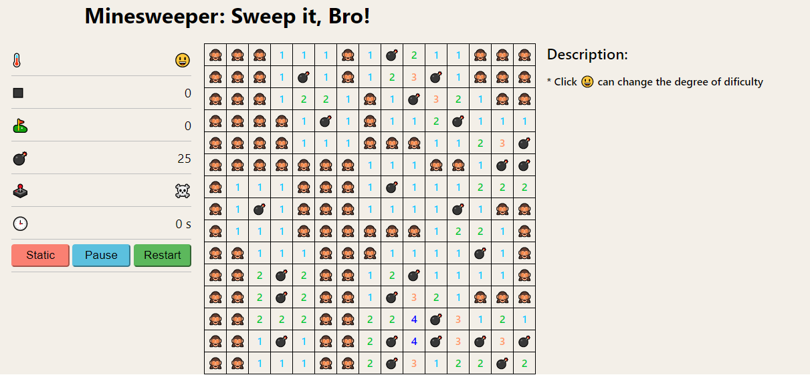
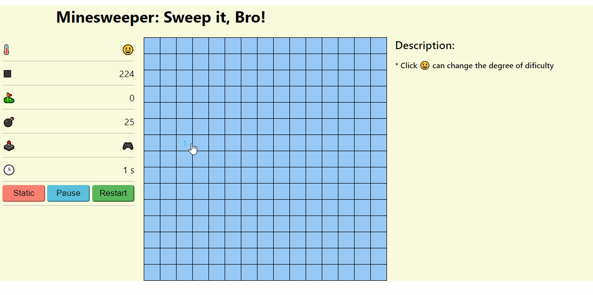

## 扫雷游戏

#### 规则

1. 在n * n的矩阵内，找出所有的地雷
2. 鼠标左击表示翻开，右击表示标记或取消标记
3. 翻开方块时，如果是地雷，游戏结束
4. 每个方块中的数字表示周围一圈（八个）九宫格内，存在的地雷总数
5. 翻开空白方块时，自动翻开周围方块

#### 截图

#### 已完成

1. 切换难度

2. 展示数据

3. 暂停\继续(为计时做准备)

4. 从新开始

5. 游戏状态记录和展示

6. 界面调优..

7. 计时器

#### 待完成

1. 自定义格子(M * N)
2. 更多功能按钮
3. 设备自适应

#### 更新记录

