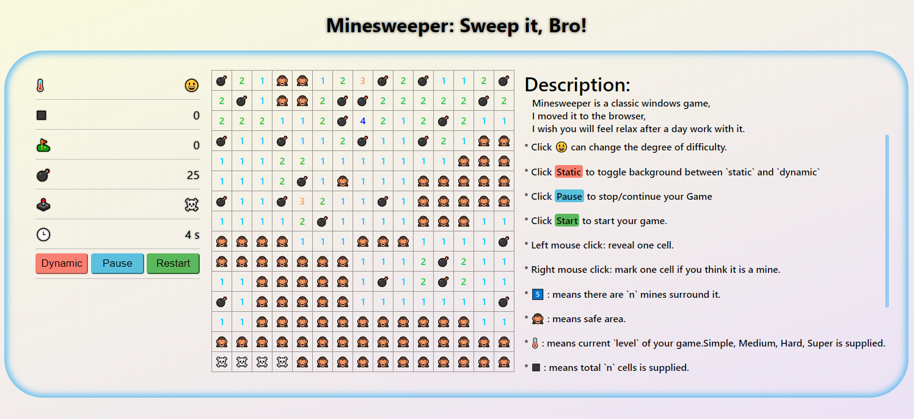

# Minesweeper[中文](./README_ZH.md)

* [Sexy soldier, sweep it online!](https://wanderhuang.github.io/react-minesweeper-sweep-it/)

## Rules

1. Find out all mines in matrix(n * n)
2. Click for triggering, right click for marking or unmarking.
3. If you trigger a mine, game over.
4. Every number inner the box stand for total mines arround in matrix(3 * 3)
5. Trigger an empty box will trigger all surrounded boxes too.

## Looks like

## Finished

1. level

2. game datas

3. pause\continue

4. restart

5. game status

6. beautify ui..

7. clock

## To do

1. custom matrix(M * N)
2. more functions
3. device adaptation
4. more docs

## 更新记录

1. *20190815* deployment
2. *20190816*
   * animation after success
   * animation after fail
   * add Description
   * fix some logic code
